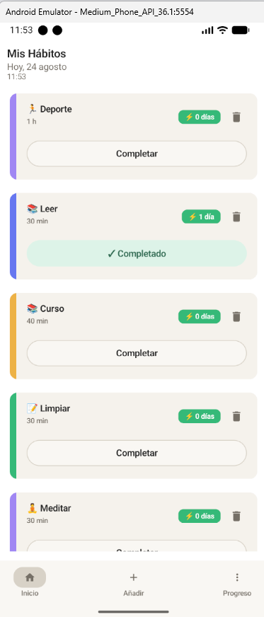
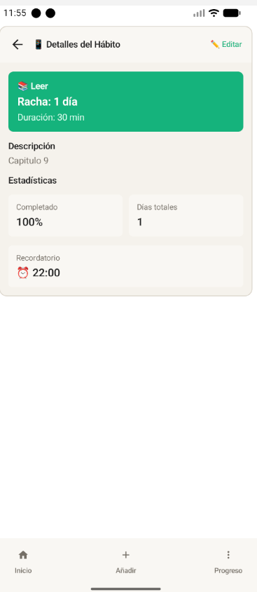
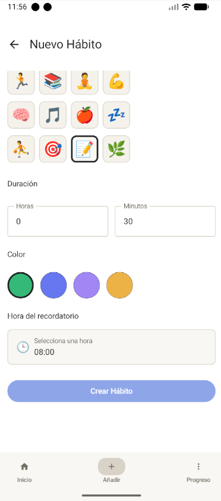
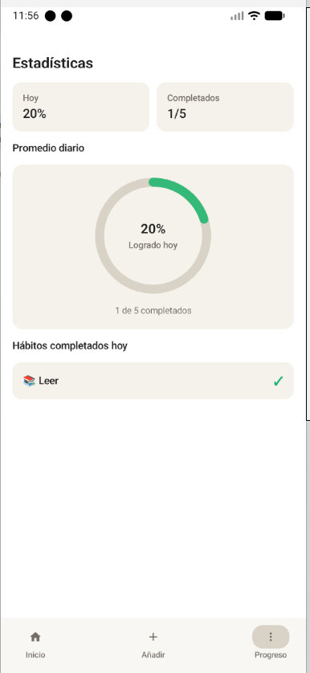
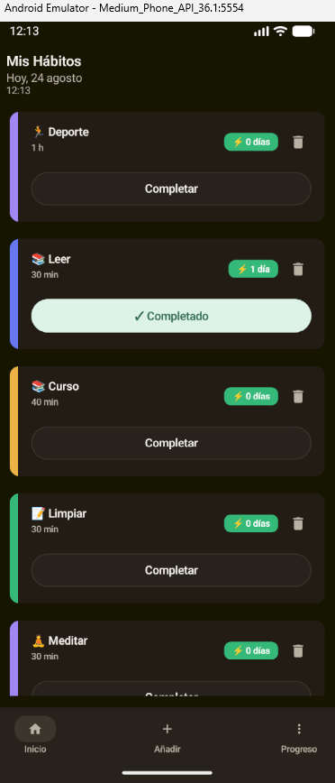
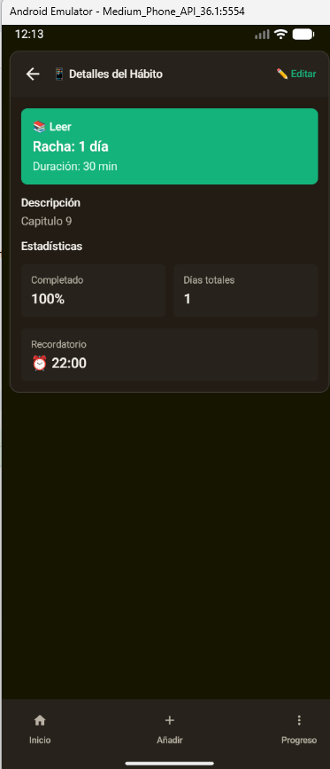
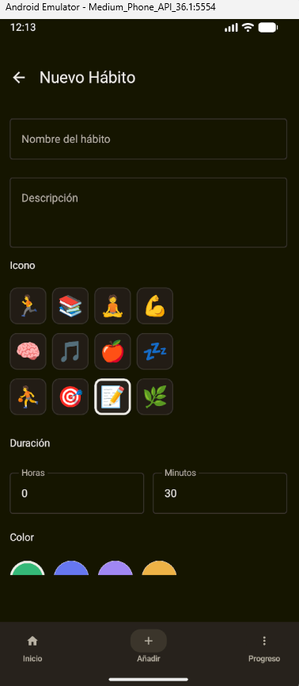
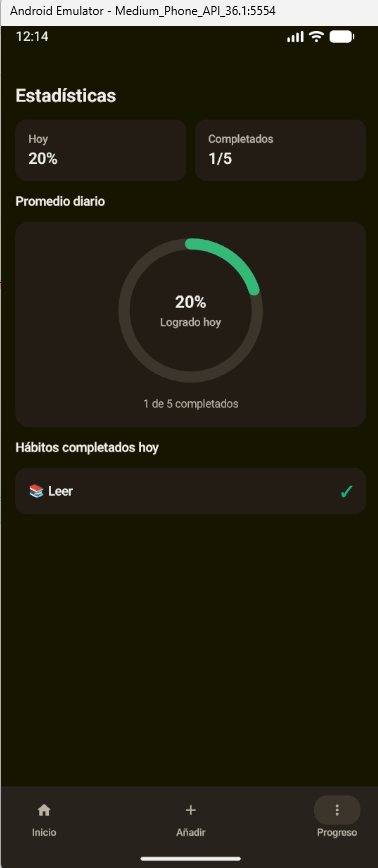
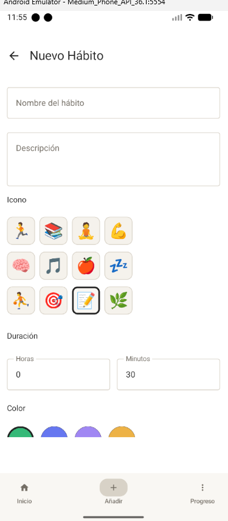

# 🧭 Habitus


Aplicación Android nativa para el seguimiento diario de hábitos, construida con **Kotlin** y **Jetpack Compose**. Permite crear hábitos personalizados, marcarlos como completados cada día, ver su racha y estadísticas de cumplimiento, y recibir recordatorios diarios.

> Proyecto desarrollado como parte de mi formación como desarrolladora full stack. Documento aquí tanto las decisiones de arquitectura como el proceso de depuración y mejora del código.

---

## ✨ Funcionalidades

- **Gestión de hábitos**: crear, editar y eliminar hábitos con nombre, descripción, icono, color, duración y hora de recordatorio.
- **Seguimiento diario**: marcar un hábito como completado hoy con un toque.
- **Racha (streak)**: cuenta los días consecutivos completados, con un periodo de gracia — si aún no has completado el hábito hoy, la racha del día anterior no se pierde hasta que el día termine de verdad.
- **Estadísticas**: porcentaje de cumplimiento de los últimos 30 días, días totales completados históricamente, y resumen diario en la pestaña de Progreso.
- **Recordatorios diarios**: notificaciones programadas por hábito mediante `WorkManager`, independientes entre sí aunque dos hábitos compartan nombre.
- **Modo oscuro**: soporte completo, sigue el tema del sistema.
- **Multi-idioma**: español e inglés, con plurales gestionados correctamente (`1 día` / `2 días`).

## 🖼️ Capturas de pantalla

<table>
  <tr>
    <th>Inicio</th>
    <th>Detalle</th>
    <th>Nuevo hábito</th>
    <th>Progreso</th>
  </tr>
  <tr>
    <td></td>
    <td></td>
    <td></td>
    <td></td>
  </tr>
  <tr>
    <td></td>
    <td></td>
    <td></td>
    <td></td>
  </tr>
</table>

<details>
<summary>Ver más capturas del formulario de creación de hábito</summary>
<br/>

</details>

## 🛠️ Stack técnico

| Área | Tecnología |
|---|---|
| Lenguaje | Kotlin |
| UI | Jetpack Compose + Material Design 3 |
| Arquitectura | MVVM |
| Persistencia | Room (SQLite), con migraciones versionadas |
| Estado asíncrono | Coroutines + `LiveData` |
| Navegación | Navigation Compose |
| Tareas en segundo plano | WorkManager (recordatorios diarios) |
| Gestión de dependencias | Gradle Version Catalog (`libs.versions.toml`) |
| Tests | JUnit (lógica de dominio pura) |

## 🏗️ Arquitectura

El proyecto sigue una separación por capas típica de MVVM, con un pequeño añadido: la lógica de negocio más delicada (el cálculo de racha) se extrajo a una **capa de dominio** sin dependencias de Android, precisamente para poder testearla con tests unitarios normales, sin emulador:

```
com.app.habitus
├── data
│   ├── local        → Room: AppDatabase, HabitDao, HabitRepository
│   └── models        → Entidades: Habit, HabitLog
├── domain
│   └── StreakCalculator   → lógica pura de cálculo de racha (testeada)
├── notifications      → WorkManager: recordatorios diarios
├── navigation          → Navigation Compose (rutas y NavGraph)
├── ui
│   ├── components      → Composables reutilizables (HabitCard, ProgressChart...)
│   ├── screens          → Pantallas (Home, AddHabit, Detail, Stats)
│   └── theme              → Tema Material 3 (claro/oscuro), tipografía, colores
└── viewmodel            → HabitViewModel (estado compartido entre pantallas)
```

**Flujo de datos**: `UI (Compose)` → `ViewModel` → `Repository` → `Room DAO`, con `LiveData` propagando los cambios de vuelta a la UI. El `ViewModel` no conoce Room directamente; todo pasa por el `Repository`, lo que permitiría sustituir la fuente de datos sin tocar la UI.

## ✅ Tests

La lógica de cálculo de racha (`StreakCalculator`) está cubierta por tests unitarios JVM que no requieren emulador ni Android Framework — se ejecutan al instante:

```bash
./gradlew test
```

O desde Android Studio, botón ▶️ junto a `StreakCalculatorTest`.

## 🚀 Cómo ejecutarlo

**Requisitos**: Android Studio (Narwhal o superior), JDK 11+, un emulador o dispositivo con Android 7.0 (API 24) o superior.

```bash
git clone <url-de-este-repositorio>
```

1. Abre el proyecto en Android Studio.
2. Espera al Gradle Sync automático.
3. Ejecuta ▶️ en un emulador o dispositivo físico.

No requiere ninguna clave de API ni configuración adicional.

## 📌 Decisiones de diseño destacadas

- **Racha con periodo de gracia**: en vez de resetear la racha a 0 en cuanto empieza un nuevo día, se cuenta desde el último día realmente completado, evitando una experiencia frustrante para el usuario.
- **Recordatorios por id, no por nombre**: dos hábitos con el mismo nombre no se pisan la notificación entre sí, porque `WorkManager` los identifica por el id autogenerado de la base de datos.
- **Migraciones de Room explícitas**: los cambios de esquema (por ejemplo, añadir icono y duración a un hábito) se gestionan con `Migration`, no con destrucción de datos, para no perder la información del usuario al actualizar la app.

## 🔮 Posibles mejoras futuras

- Gráficas de evolución histórica (no solo el % de los últimos 30 días).
- Widget de pantalla de inicio.
- Exportar/importar datos.
- Tests instrumentados para la migración de base de datos y para los flujos de UI con Compose Testing.

## 📄 Licencia

Este proyecto está bajo licencia MIT — ver [LICENSE](LICENSE).

## 👩‍💻 Autora

**[TU-NOMBRE]**

[](https://github.com/[TU-USUARIO-GITHUB])
[]([TU-URL-GITHUB-PAGES])
[]([TU-URL-LINKEDIN])